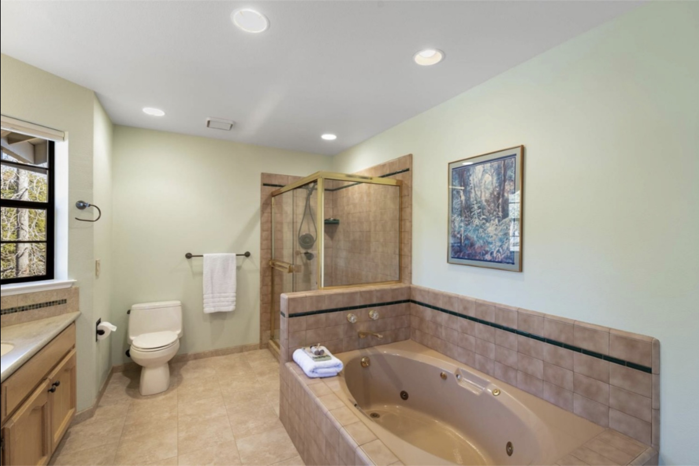

This is a one of a kind property, with stunning sunset views and a truly unique pool and hottub. Nestled at the intersect of the oak savannah and the alpine forests, a filled with abundant life including deer, turkey, frogs, lizards, and birds of all sorts. Every season brings dramatically different hues and colors. The house is a well-appointed and skillfully laid-out 3,543 square feet. It sits a few hundred yards off a quiet road; very private and very quiet. All of this and you are still only 15 minutes from downtown Nevada City/Grass Valley, 25 minutes from the beautiful Yuba River and just over two hours from the Bay Area. The area holds many hiking and mountain-bike trails, and ready access to the snow resorts of North Lake Tahoe.

This is a fantastic house for hosting pool parties, dinner-parties, overnight guests and visitors. 4 private bedrooms, 3 full baths, two private decks for each of the 'main' bedrooms, a large rear deck with retracable awnings (overlooking the meadow and pond), spacious kitchen and two large living rooms. Fiber internet brings the world to you with the snap of your fingers. Central heat and air on both floors, plus house-fan, wood-pellet stove and another electric fire-place for climate management. The pool scuplting is inspired by the rocks of the Yuba river and includes multiple waterfalls and a propane heated hottub that can sit twenty. 3 car detached garage and the large unfinished basement round out the storage options for the property. NID water allocation allows you to keep the garden green all summer and feeds the pond at the bottom of the property. The roof and solar system were updated in 2021, doubling the capacity of the solar, and otherwise we have kept on top of maintenance across the property over these years.

The property will be available in Spring 2024. We would love to keep it in the community, and will be talking with interested folk about how we can manage that over the winter. We are hoping to get around 1.1 million for the property and if we can minimize closing costs by running an off-market sale, we would love to share the savings of that with whomever buys the property.

The property could easily be split by two couples that are starting their families, as the bedrooms nicely divide into two 'wings' on the top-floor. There is also space for the construction of an ADU, a great way to increase the residential space on the property for guests, family, long or short term rental. The property is on a septic system and gets fresh water from a 15 gpm well.

Please reach out to us at thomasgabriel.watson at gmail dot com with your enquiries.

## Overall property photos

## Floor-plan

## Front-door and other exterior

## Pool

# First floor

## West Living Room

## East Living Room

## Dining

## Kitchen

## Laundry and Mudroom

## Downstairs Bathroom

## Deck

# Second floor

## West Main Bedroom

Over 300 sqft including walk-in wardobe

## West Bathroom

Two doors, one opens to the West Main bedroom, the other to the hallway. Dual sink vanity, shower and toilet

## West Inner Bedroom

15 x 11 with built-in closet

## East Inner Bedroom

12 x 10 with walk-in closet

## East Bathroom

Large ensuite and walk-in wardobe for the East Main bedroom. In-floor radiant heating, bath, shower, dual sink vanity and toilet

## East Main Bedroom

Over 300 sqft including walk-in and ensuite

Once again, if you are curious about the property please reach out to us at h3arthouse at gmail dot com with your enquiries.
