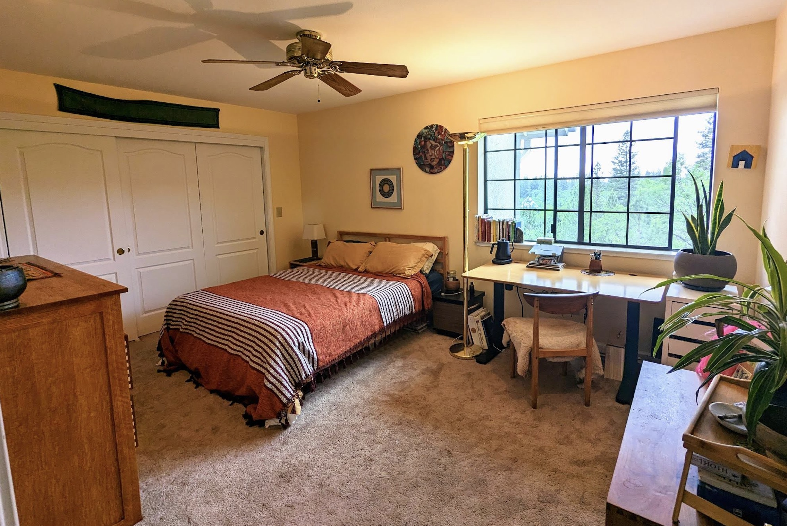
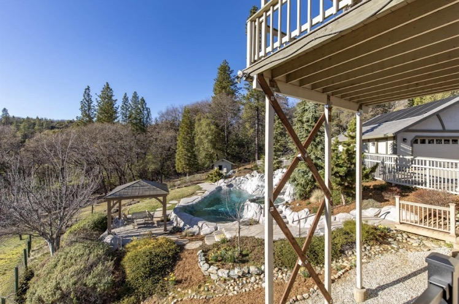
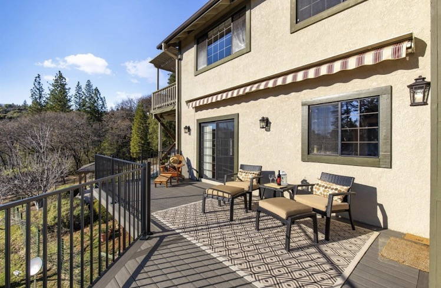

Come get some time in the foothills of the Sierra Nevada this winter. We've had two big snow years the last two seasons, and I've loved being close to the resorts like Sugarbowl, Northstar and Palisades. The distance makes day-trips over Donner pass very viable to those resorts. I am heading home to Australia and New Zealand, for the southern summer, so someone else is going to need to hit those powder runs this winter.

The room is part of a 3500+ square foot residence, just over 2 hours from the Bay Area and 15 minutes from the delightful towns of Nevada City and Grass Valley. The house has fiber internet, and plenty of space; practically everyone in the house has been working remotely.

The room is 15 x 11 feet, with a 9 foot build-in closet, and will be furnished with a standing desk, queen bed, bedside table, lamp and large dresser. The property is 5 acres, with stunning sunset views, lots of pine and oak trees, a pool (consider it a cold plunge) and a large hottub. The winter will be either a bunch of brisk sunny days (great mountain biking in the area) or big winter storms (which can be quite an adventure...) We have just had two big wet winters in a row, hard to imagine there will be a third like that. [This site](https://certifiedsnowfalltotals.com/storm_history/history/CA/2050/8788/Grass%20Valley%2C%2095945) might give you an idea of what the last few winters have looked like. By this time last year we'd already got snow but none on the horizon so far this winter. There is a big garage to store stuff in, two large living rooms, including big tv for those nights rugging up in front of a movie, and large kitchen.

The local community has a decent amount of cuisine options for the size of the town, several weekly dances, lots of nature, and the beautiful Yuba river. We can plug you into the local scene fairly easily. The other housemates will be a mix of folks who will be back-and-forth between Grass Valley and the Bay and maybe another subletter. Obviously, the sublet would be contingent on you being someone that cleans up after themselves in the kitchen and common-areas, and takes care of the bathroom associated with this bedroom.

Ideally the sublet would be for the whole time (two months) but I will consider shorter stays. The rate is $2000 for the full two months or prorata $1300 per month for shorter stays.

Please email your questions and interest to tom at hylo dot com

