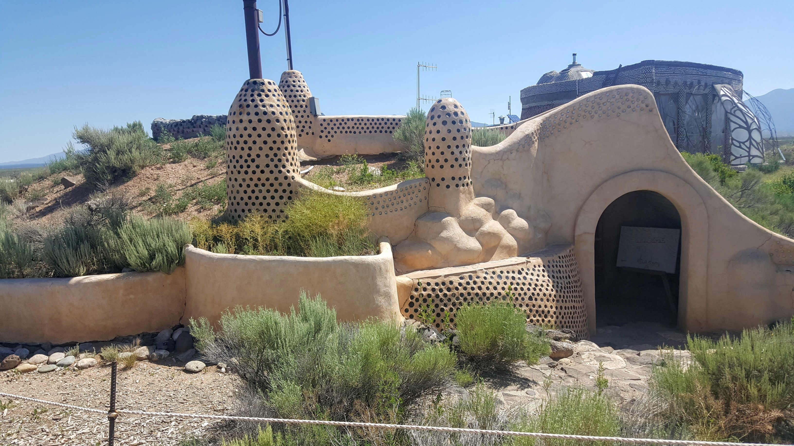
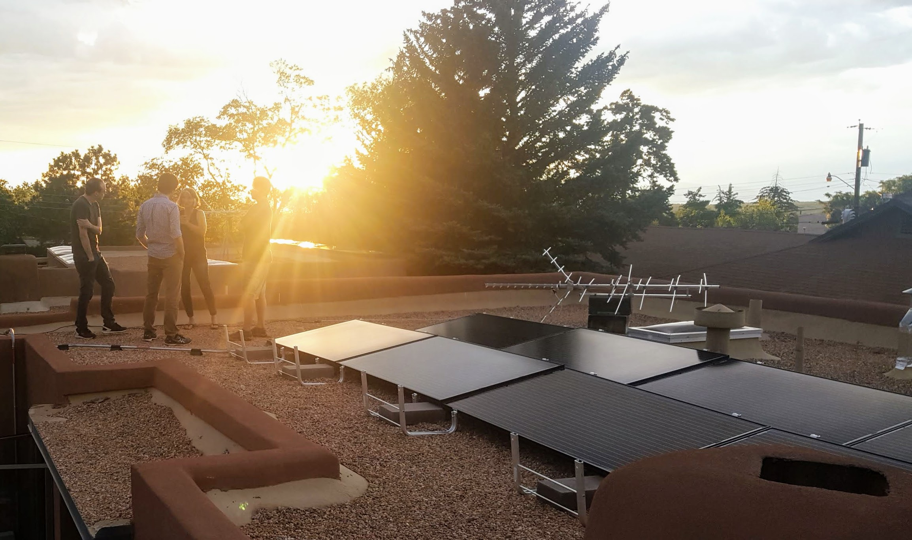
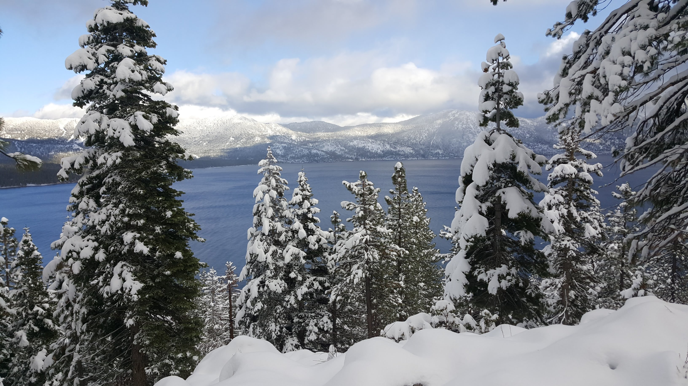
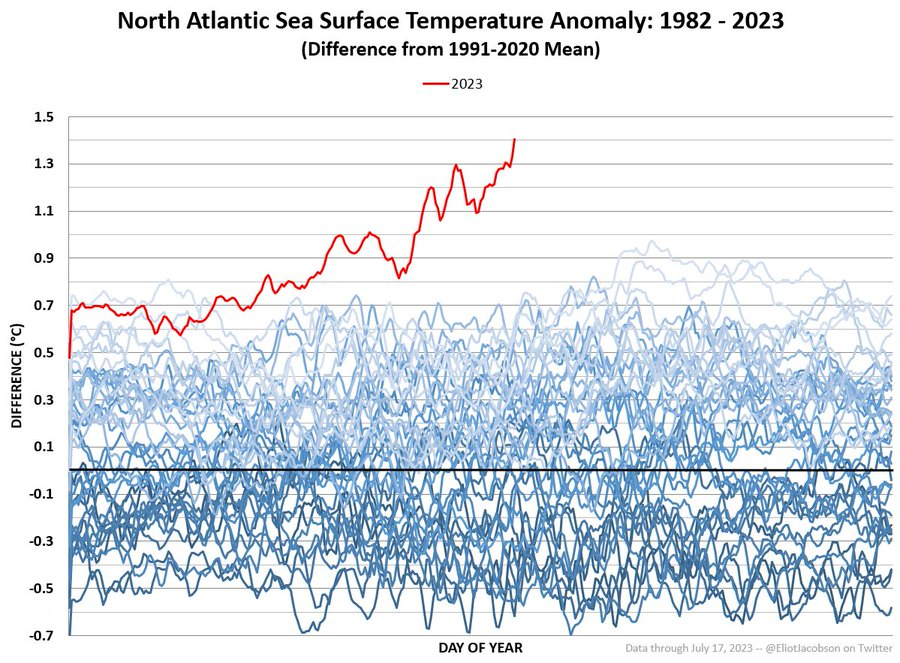
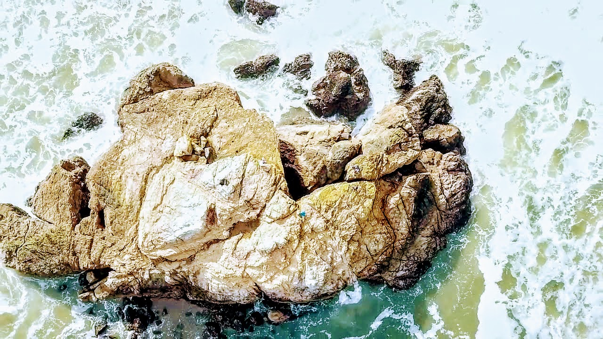

Four years ago, after writing about Little and Big Civilization, I wrote out a watch-list of progress-markers for how humanity was grappling with climate chaos. You can review that [first watchlist here.](https://twicefire.com/littleciv/watchlist/)

So, how have we gone in the last four years? In short; not great but with a couple of positive developments, particularly in clean power generation.

As I previously shared, this list is not in any order, and will be my running best estimate for the top factors we ought to be tracking to have a strategic view of the climate challenge, and wider civilizational stability. I have also made some additions to the focus areas since 2023, including:

- Enhanced Geothermal power production
- Artificial Intelligence developments
- Global supply chain disruption
- Ocean heat

Each of these things have become changed enough to warrant their own heading, instead of being lumped under another topic.

---

### How to read the watch-list

The bulk of the list focuses on interventions. These are actions and efforts that we can take to address the climate challenge. We probably need a strong mix of many of these interventions to be implemented to truly address the climate challenge but it is wise not to get too focused on any particular intervention; we might roll it out and find it does not produce the results we desire. As it currently stands, even if we hugely rolled out these intervention in the coming decade, we still face the risk that some climate related impacts will get worse before they get better. We are already seeing serious ecological degradation and flow on strain on human systems.

The bottom part of the list are signals we should be paying attention to, in order to track the overall health of earth, from an ecological perspective. They provide gross (overall) feedback on planetary wide factors; we should still be very interested in impacts at more localized levels, particularly when evaluating and understanding interventions.

The intention for the watch-list will be to continue to find good quality intervention/signal sources and continue periodically review progress (or otherwise) in the coming years.

#### The Watch List

- **Interventions**
  - Built-environment
  - Clean Energy
  - Societal Cost of Emissions
  - Land-use
  - Net Negative Emissions Techniques
  - Human factors
- **Signals**
  - Global Metrics
  - The Amazon
  - Ice
  - Ocean Health

##### Built-environment

Why:
The built environment refers to the structures we live and work in. Globally, most of those structures are in cities; since 2007 the majority of humanity resides in cities, with that percentage continuing to increase. Emissions occur both in the construction of these buildings and then over their lifetime, primarily from heating/cooling and ventilation. Globally, most building in the next decade will occur in China, with India and Africa being the projected major building sites of the following two decades

Summary:
Overall its slow progress in this matter. Six regions have adopted Zero Code; none of which reside in Asia or Africa (where we expect the bulk of buildings to be built in the coming decades). China has adopted some form of standard for low/zero energy building but I have no current means to assess adoption. Some promising, ecologically-sound building materials cannot yet be included in low/no carbon building calculations because proper ways of accounting for them have not been accepted/agreed upon. Modular strawbale and/or mass timber walls could be great ways to lock carbon into buildings.

What to watch in this domain:

  - Adoption of Zero Code or similar built-environment outcomes
  - In China
  - In India
  - In Africa
  - In the rest of the world
  - By the top multi-national architectural firms. Example of org pursing this
  - Systems to account for carbon-capture potential for building materials like strawbale, mass timber construction and similar

Indicator: Global level of green building adoption

Tracked by: Global Green Building Council Status Reports

##### Clean Energy

Why:
Affordable/cheap energy underpins everything about how our society runs. Instead of little civilization and big civilization, I could have just called them low-energy civilization and high-energy civilization.

Summary:
Some important shifts in the clean energy sector. There are sour notes: fossil fuel use has not declined, and some countries are decommissioning functioning nuclear power plants and using fossil fuels instead. On the upside, we have continued growth of renewables, an exciting regulatory approval for small modular nuclear reactors in the US and really exciting demonstrations of technology for enhanced geothermal. Those last two could change the shape of baseload power supply across the world in the coming decades, an area where clean/renewable energy has struggled to take away the dominance of fossil fuel energy.

What to watch in this domain:

- Renewables adoption
  - Assessment: Steady improvement
- Affordable/effective energy storage technology
  - Assessment: Nothing significant to report
- Fossil fuel divestment (including natural gas/fracking)
  - Assessment: A transition from coal to… gas. The USA has become a net-energy exporter thanks to fracking.
- Nuclear cost/safety breakthroughs
  - Actually noteworthy change in the USA (UPDATE 2024: Unforunately the company went bust, so progress has been lost)
  - Small modular reactors could be a very flexible way to generate safe baseload energy, in a way that mitigates proliferation concerns.
  - Still yet to determine whether they are commercially viable
  - Demonstration model expected to be running in 2029
  - DOE is currently working with Utah Associated Municipal Power Systems (UAMPS) through the Carbon Free Power Project to demonstrate a six-module NuScale VOYGR plant at Idaho National Laboratory.
  - The first module is expected to be operational by 2029 with full plant operation the following year.
- Enhanced Geothermal
  - Promising advances have occurred with enhanced geothermal in the last few years
  - Related explainer from 2020: https://www.vox.com/energy-and-environment/2020/10/21/21515461/renewable-energy-geothermal-egs-ags-supercritical
  - Fervo Energy’s commercial pilot project confirmed good production in the first half of 2023.
  - “With Fervo’s breakthrough, no technological barriers to geothermal deployment remain.”

Indicator: Global adoption of clean energy and phasing out of fossil fuels

Tracked by: REN21 Global Status Reports

##### Societal Cost of Emissions
Why:
If we fail to price and account for emissions as negative externalities, we will continue to promote economic activity that makes a profit for those directly involved, at the cost of the greater good.

Summary:
No significant improvement in pricing carbon. Unfortunately there are a lot of dud carbon credit projects; boon-doggles and simplistic implementations

What to watch in this domain:

- Carbon pricing/markets/credits
- Regional adoption of carbon markets/taxes/credits
- Global adoption of carbon markets/taxes/credits

Indicator: Global carbon markets

Tracked by: I do not currently have meta-review resources to track progress on this.

##### Land-use
Why:
Human activity prior to industrialization was a sufficient boost in CO2 levels (from 240 to 280 ppm) to effectively avoid the start of the next glaciation period, and subsequently, in several thousand years, the next ice age. This change mainly stemmed from our land-use, through deforestation, urbanization, agriculture and grassland degradation. While the use of fossil fuels does dominate our imagery around the climate challenge, this impact from our relationship to the land (and ocean) is still very much with us. Restoration and changes in land-use do not mean removing human activity from ecological systems. There are many ways we can actively participate as stewards of ecological systems.

Summary:
Limited progress to report. Which doesn’t mean this has been neutral, because the status quo for most of these areas has been heading in the negative direction. There is an effort to update the measurement methodology for “Reducing Emissions from Deforestation and Forest Degradation in Developing Countries” aka REDD+. This is needed because simplistic monocrop-big-volume-little-planning forest plantations are far too common and typically do not create lasting positive change.

What to watch in this domain:

- Reforestation/Afforestation
- Grasslands restoration
- Agricultural practices
- Soil ecology
- Mangroves/wetlands/marshlands restoration
- Return of land to indigenous stewardship (especially with subsequent climate focused funding)
- The UN’s “Reducing Emissions from Deforestation and Forest Degradation in Developing Countries” aka [REDD+](https://www.forestcarbonpartnership.org/what-redd)

Indicators: I don’t think there are globally recognised ways of comparing the level of regenerative land-use, especially between different types of ecologies. Even REDD+ has been critiqued and subsequently improved for there being a disconnect between metrics and impacts on the land.

Tracked by: I do not currently have meta-review resources to track progress on this.

##### Net Negative Emissions Techniques
Why:
The reality is that if humans vanished from the face of the earth overnight, significant climate chaos is already locked into the future century. We need to implement interventions that put carbon back into the earth or ocean. These can take a multitude of forms, and need to be validated and tested to ensure they can actually help.

Summary:
One promising update is a study into cropland rock weathering. The application of ground-up basalt to croplands has seen a promising initial study, suggesting that it absorbs a decent amount of carbon (even adjusting for energy inputs), and improves crop yields. Beyond that, no significant changes to report.

What to watch in this domain:

- Biochar ([example](https://www.earthcarellc.com/))
- Sea Fertilization ([Quite unpopular](http://www.geoengineeringmonitor.org/2018/05/ocean-fertilization/))
- Direct Air Capture ([example](https://www.climeworks.com/))
- Rock Weathering ([example](https://projectvesta.org/))
  - Promising study for cropland weathering with [explainer thread](https://twitter.com/PeterOlivier/status/1680928555725717505)
- Bio-energy with carbon capture and storage aka [BECCS](https://www.carbonbrief.org/beccs-the-story-of-climate-changes-saviour-technology)

Indicators: The level of investment/funding going into negative emission techniques

Tracked by: I do not currently have meta-review resources to track progress on this.

##### Human factors
Why:
This is a catch-all category for other factors that will have flow-on impacts on to the climate challenge. If they happen at a wide enough scale, they will end up having an impact on the climate challenge.

Summary:
Each of these is distinct enough that I’ll address them individually below. Artificial Intelligence has reached a tipping point where it is going to start increasingly inserting itself into all things, so it is getting included. I added global supply chains because I should have included them previously.

What to watch in this domain:

- Low or No Growth Policies and their Success/Failure
  - The UK is kinda of doing this, maybe by accident? I do not think these sorts of policies have been adopted officially anywhere, so little to report.
- Global Access to Birth Control and Education For Women
  - These are causally linked to falling birth rates. Across the globe, they are generally plummeting, with many ‘advanced’ economies struggling to make population replacement rate (2.1 kids per couple). South Korea is below 1! Japan and South Korea are the places to watch, to see how these demographic changes play out.
  - On one hand, the global drop in birth-rates takes some of the heat out of the overconsumption of rich societies. But on the other hand, it will likely lead to difficult societal dynamics. Older generations will be less invested in the wellbeing of younger generations and the future in general, limiting societal resilience.
- Disaster/Pandemic/Famine Preparation
  - LOL, how did that go?
  - Covid has been informative; many societies struggled to act in cohesive and agile ways about how to manage the pandemic (certainly a very difficult task). The covid19 pandemic has weakened most societies ability to deal with pandemics; societial trust in public health institutions is rattled in many places, health-systems have been stretched and degraded, and a small subset of the population are now more vulnerable to subsequent pandemics.
- Conflict
  -The growing cold-war between the USA et al and China does not bode well for global stability, or cohesive climate coordination.
  - I do not read the recent uptick in open-warfare in the Russian invasion of Ukraine to be related to climate induced scarcity or the like but the widening of the conflict has shifted global geopolitics to a more openly adversarial phase.
  - NATO is so back. Putin’s has single-handedly revived the purpose of NATO, resolidifying the alliance. No more peace-dividend, unfortunately, as the fear of conflict increases.
- AI developments
  - AI is incredibly ‘frothy’ right now. Lots of advances in some sectors of the field are breaking into mass awareness.
  - No direct impact on climate matters right now but the AI will seep into every other field and attempt to disrupt
- Global supply-chain disruption
  -The covid19 pandemic certainly got the global supply chain fairly wonky but it is a resilient beast. I do expect to see it put under increasing pressure over the decades, from both climate chaos and China/USA friction. However, news of its pending demise are greatly exaggerated.

Tracked by: I do not currently have meta-review resources to track progress on this.

### Global Signals
Why:
Global signals are more about keeping track of the impacts of climate change. These should help us get a general sense of whether things are getting better or worse with how we are facing up to the climate challenge. These include global average metrics for things like CO2 or temperature and ecological systems that have an out-sized impact on global ecological health.

Summary:
Generally all trending negative, aside from global agricultural yields, which is just bouncing around.

##### Global metrics
- Atmospheric CO2 concentration
  - Continues its steady ascent
- Sea Level
  - Continues a slow rise
- Global Surface Temperature Average
  - Continues a slow average rise, with some serious spikes this year, ascribed to the loss of sun-blocking aerosols during the early pandemic slow-downs
- Global Refugee/displaced peoples
  - A sharp uptick over the last few years in global displaced people numbers
- Global agricultural yields (USDA has reporting on global yields)
  - While there are many examples of famine and variation in yield for different regions over the last few years, at a quick review, there does not seem to be a significant trend in changes to yield global.
  

##### The Amazon
Why:
The Amazon’s scale and impact is such that its health is something of a global symbol of how our relationship to nature is going, and thus it makes it on to my list of top indicators. Unfortunately, as I type this, media reports of expansive fires and further attacks on communities indigenous to the Amazon are trickling out of Brazil.

What to watch in this domain:

- Deforestation
  - Deforestation in the Amazon trended down from the mid-2000s to 2012 and have been steadily rising since then. So, not a good trend.
- Ecological collapse
  - There is not a straight-forward way to determine the rate or area of ecological collapse in the Amazon basis. For this check-in, I am not dedicating the time to figure out a qualitive take on this point.

##### Ice
Why:
Surface ice, frozen water locked into glaciers, ice shelves and the like, represent a vast stock of potential sea-level rise if melted. Sea-ice and surface ice both contribute to high albedo earth surfaces, better at reflecting the radiative energy of the sun (consequently, the more of it we lose, the faster the earth will heat up). Finally, accelerated glacier melt risks flash-flooding and the loss of fresh water from certain ecologies and human settlements.

Summary:
Continued decline :(

- [Arctic ice](https://climate.nasa.gov/vital-signs/arctic-sea-ice/)
  - Continued decline
- [Northen Ice Sheets](https://climate.nasa.gov/vital-signs/ice-sheets/)
  - Continued decline
- Albedo of Sea Ice. [Example of org pursing](https://www.ice911.org/)
  - No significant developments
- Global Glacier Melt. [Possible tracking via NOAA](https://www.climate.gov/news-features/understanding-climate/climate-change-glacier-mass-balance)
  - Continued decline

Trackers:
- [Arctic Sea Ice News](https://nsidc.org/arcticseaicenews/)

##### Ocean health
Why:
The oceans represent a huge part of earth’s ecology that we tend to literally just skim over the surface of. It is a huge thermal and chemical buffer in the global ecology; it has absorbed a lot of energy and CO2 over the centuries since industrialization. We do risk that it will become less capable of acting as this buffer, and that significant system wide chaos and change will stem from changes to the oceans.

What to watch in this domain:

- Ocean Acidification
  - https://ourworldindata.org/sdgs/life-below-water
  - Continued slow acidification
- Ocean Oxygen Depletion
  - Did not find cohesive data in short review.
- Over-fishing
  - Progress in USA waters, historically low levels of overfishing present
  - New International agreement reached to reduce overfishing: https://www.pewtrusts.org/en/research-and-analysis/articles/2022/09/20/global-deal-will-help-reduce-overfishing-and-improve-ocean-health
    -Too early to determine impact
- Levels of Plastic and Other Waste
  - Hard to determine level of impact, although there is growing concern about the impact of micro-plastics on ecological health across all ecologies
- Ocean heat (Added 2023)
  - The ocean acts as a huge buffer of heat energy, moderating air temperature around the world. If it can no longer act as a heat-sink for excess energy, we may see rapid changes in the lived experience of different climate zones.
  - https://twitter.com/EliotJacobson/status/1681321023306874880?t=tDFY15NVwkcSspcH7hr9Ww&s=19
- Coral reef health as signal
  - Not a great five year period for coral reefs :(
    

Indicators: Ocean health metrics including change in oxygen content, agricultural nutrient run-off, fish stocks, whale populations, pH level of ocean areas and more.

Tracked by: I do not currently have meta-review resources to track progress on this.

Overall Summary
Clean energy is probably the biggest bright spot in an otherwise negative trend. Find your local energy policy wonks and politicans and get them thinking about enhanced geothermal!

This is the analytical big-picture look… Don’t dwell on it, that will make you totally ineffective. Build your own relationship to place and tend to your bioregion. Donate to effective climate causes, support organizations that seek a regenerative relationship to the land, ocean and nature. PUSH politicians and government services at ALL levels to organize coherent climate policies. Don’t let the wish-wash of random happening get you down; focus on the long-term picture (even though it is tough!) and keep pushing to find ways to create the opportunity for a better relationship to our global ecology!