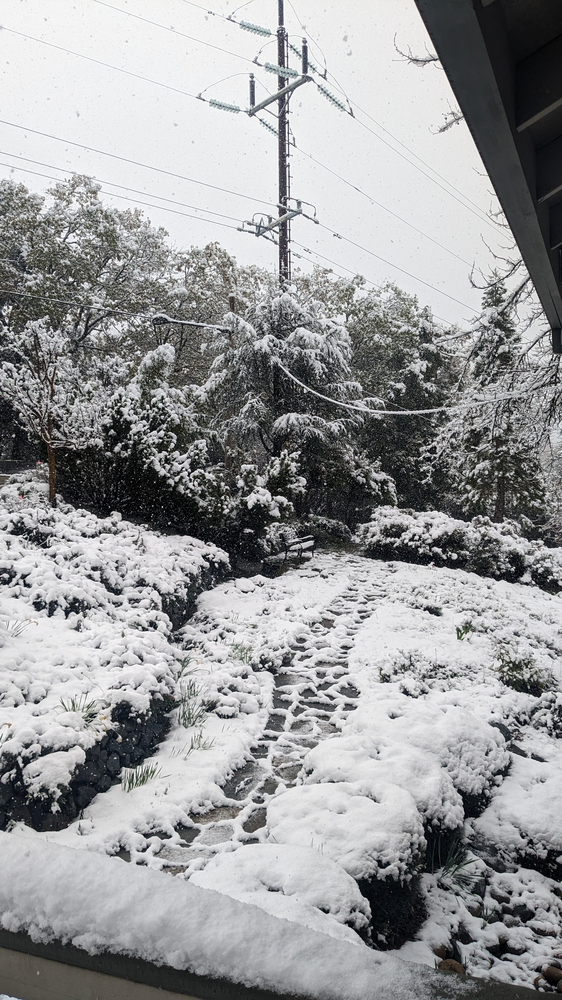
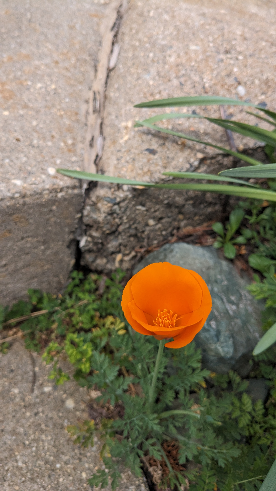
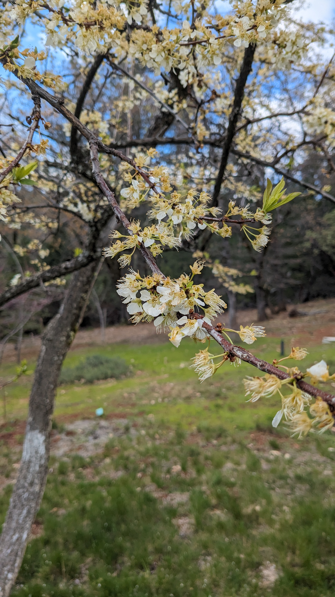

I returned to California, mid March of 2024, to resolve my life there. Just a few days after I arrived, as spring was unfolding all around me, this song was released.

[Wildflower and Barley](https://youtube.com/watch?v=_d-2LDxafF8)

It has been my dear companion for this time. Written with perhaps too much prescience, with some fated intimacy of my life that the writer does not, or ought not, have.

I sit and watch the birds, the frogs and flowers of this place. The sweetness of their spring life. I see the promise of the time ahead, beyond this moment. But for now I am here, clearing, cutting ties, packing, emptying. I missed winter here this year, but she came to say goodbye as well, with a flash of snow in April. Doing away with momentos of a life I am no longer living, and of the beloved one that is apart from me (as it is meant to be). 

> "Everything in my vision, departure and death."

Last year was a difficult one. Easy to say, the most unpleasant of my life. I look forward now; 

> "This year I swear it will be buried in action, this year I swear it will be buried in words." 

My dreams are as "useful as dirt", so "put my body to work". Time to compost my old life, return the nutrients, and energies to the wider circle of life. Keep my southern stars in my heart as I draw a line between now and this new dream. One that is both different and the same.

I also see springtime in the city, as I visit the bay on the weekends. The parks and streets starting to show signs of spring life; the grass of the parks and nooks of the side-streets are ready for us. Spring is the promise of renewal. It plays its role in the cycle with a stuttered step, rain clouds whipping us indoors after a sun-kissed day.

I sit here at my window. Another month of spring gone round. Each time this song plays, I taste different bitter-sweet moments, grief and sweet memories, wildflower and barley.