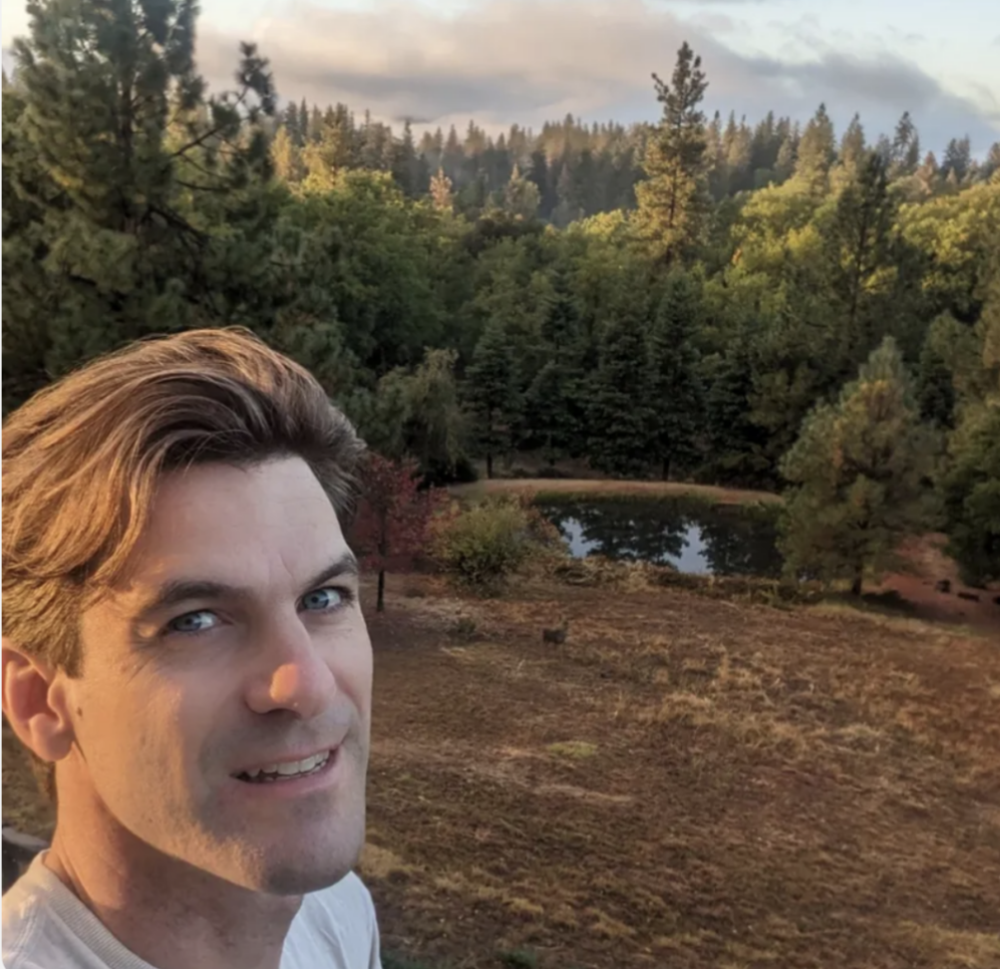
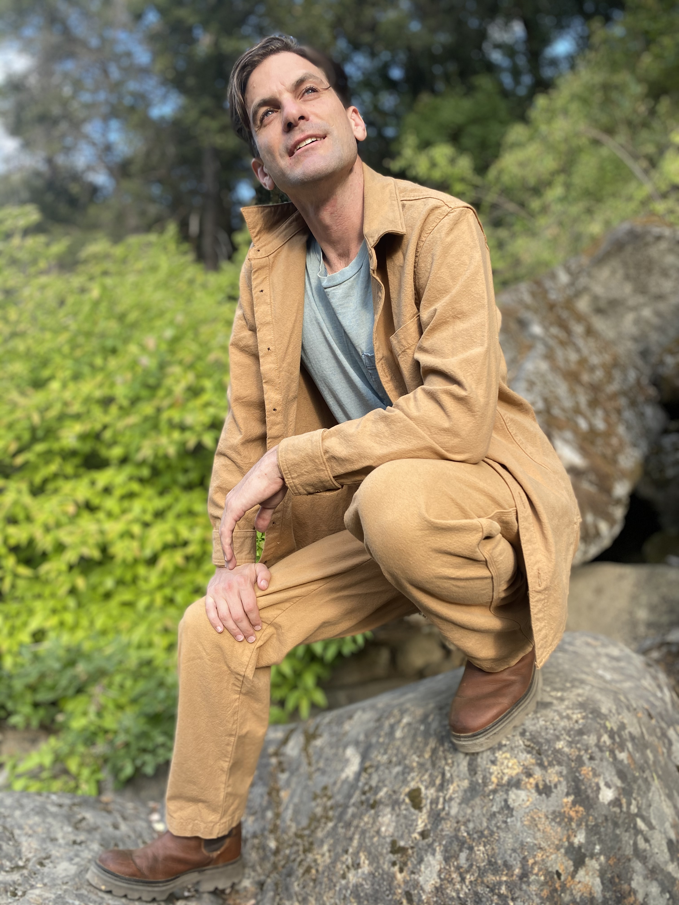
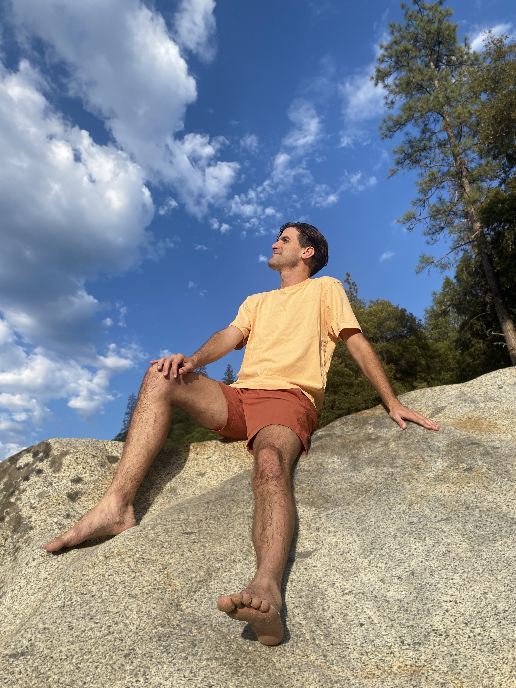
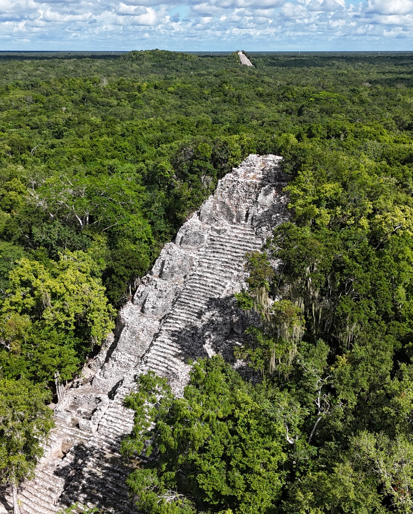
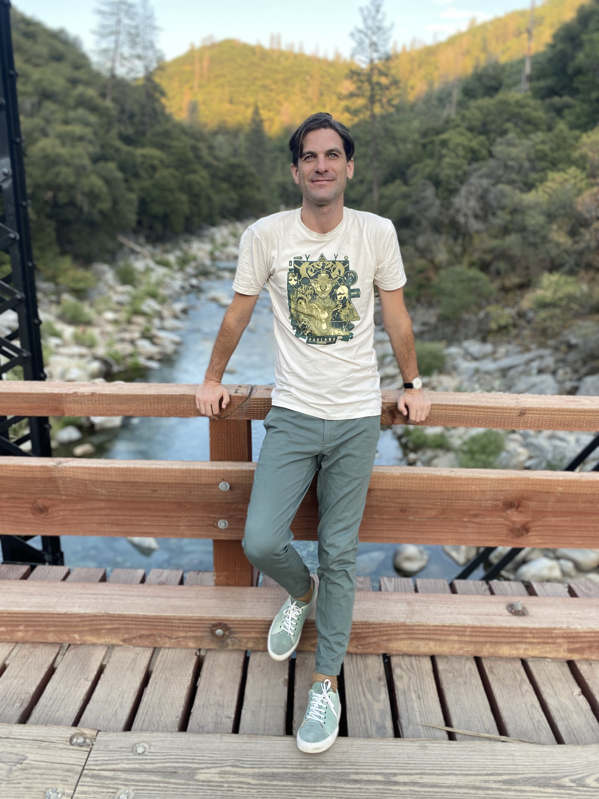
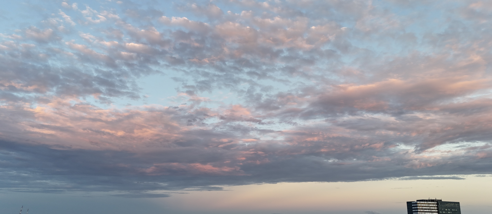
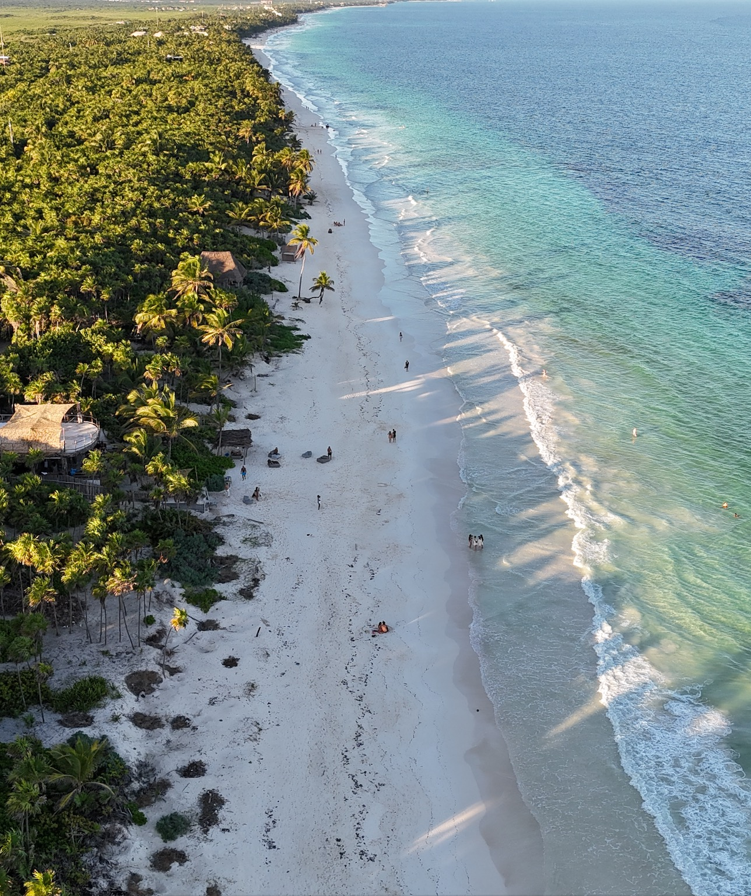
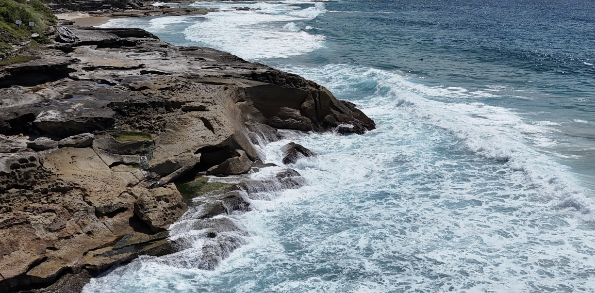
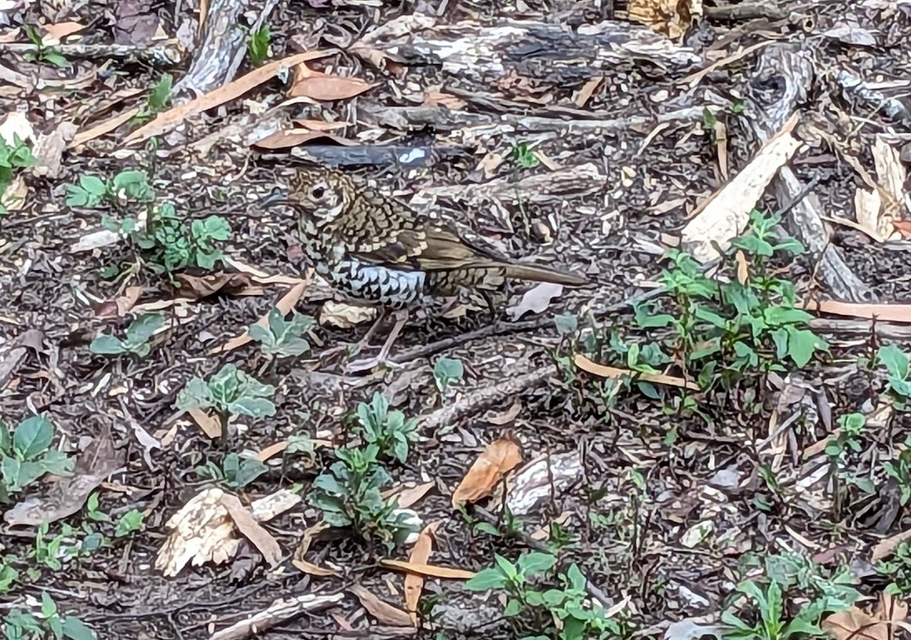

This is going to be my regnerative-dynastic version of the "Date Me" post phenomena. Take it as a prayer, as an intention; take it as me lighting a beacon.

This is worth reading if:
- You are curious why someone would be thinking about their dating life in the context of 'dynasty', specifically a regenerative one
- You know a dynastically-minded, and available dancetress who you can connect me with
- You yourself are interested in me as a partner

Summary:
> - Australian man seeks wife for wholesome usurping of the current world-order
> - Kids as priority, after an appropriate courtship
> - Preferably somewhere under the Southern Stars (Legal residency accessible in AUS and NZ)
> - Dancing is a must

## Dynasty

Not a word we hear a lot outside of period dramas, historical works, and fantasy novels. In many of those contexts, it is attached to patriarchy and dominance. That is not what I'm interested in. It is more about the intergenerational vision and the purpose that comes from that. I specifically want the 'regenerative' version of it [(and you can read more about that if you so wish)](http://localhost:8000/regen/regenerative-culture/). It has been with me over the last few months, as I have sat with questions about love, life and calling. What does dynasty evoke for you? For me, it evokes:
- Intentionality,
- Devotion,
- Love,
- Family,
- Death,
- Having children,
- My ancestors and lineages,
- My children's children, and their children, and beyond,
- Partnership,
- Co-creation with my partner and their family and lineages, and
- A greater purpose, a greater narrative, to our collective lives

We have such an incredible impact on the lives of our family. I am blessed and lucky to be a part of a great family. My folks (and their brothers and sisters) grew up with really challenging parenting circumstances. I'm so grateful to my folks for creating a loving and nurturing family-life for us. I never knew how rough they had it until I was an adult; and I learnt that from stories, not from them acting out their traumas on us kids.

We grew up in a beautiful, safe and lucky place. All of this has been an incredible gift, and I hope I honour that gift by bringing my own gifts into the world.

One of the ways I am most excited to share my gifts is by having a family. The creation of life, and the duty to uplift and care for life. Finding the right partner, mixing the wonderful gift of our lives, and co-creating an extension of our culture and lineages.

There is so much richness that I have seen in my [rites of passage work](twicefire.com/tags/rites-of-passage) over these years, and in what I have seen of my friends and family raising their own kids. And yes, a lot of Herculean efforts, nappies, tantrums, kid-drop-offs, scheduling madness, rejected meals and frustration mixed in with all of that.

This idea of regenerative dynasty asks us to consider how we are consciously acting to shape and impact the different generations of our families; whether past, living or future. What lessons and traditions are we passing down through that line? What things are we releasing and letting go of? How are we engaging with other families and friends to form wider community and resilience?

### What I seek

> "Love does not consist of gazing at each other, but in looking outward together in the same direction."
>
> Antoine de Saint-Exupéry

There are so many directions one can look. So what would our mutual direction look like? **To flesh that out, I need you and your input.** And there are important things I yearn for, and specific ways that I see that world. The things I yearn for and the way I see; well those things heavily shape how I understand the future and the context in which our children will navigate life. If you and I diverge too much on these matters, then we will not be an 'us'. And we really ought to figure that out before involving anyone else!

To begin: I want us to have a family. Of our own blood. I want our family to be born out of love, co-creation and collaboration. I am ready for this, pending an appropriate courtship. I want us to have at least two kids, possibly more. I want my children to be vaccinated and to be omnivores.

We need to share embodiment as a core dependency and ideally, we have a dance connection. Dance is such an important source of aliveness for me, and I will prioritise it in my life, now and in the future. Beyond solo freestyle, I primarily dance 'new style hustle' and 'west coast swing', both are lead/follow slot-based styles, danced to contemporary music.

I want to raise kids based on what I think the great challenges of our times are, not based on societal defaults. As best as we can prepare our youth, they will have to make their own understandings, decisions and choices about the nature of the world and the challenges we face.

I want us to be sustained by and with love, joy and tenderness. I have so much affection and love to pour into those I love. It is also true that I am comfortable being alone and have grown accustomed to being physically separated from those I care for. Having grown up in Australia and having lived almost half my adult life in California, now, where-ever I am, I will always be an ocean away from someone that I dearly care for.

A grander vision is that we live somewhere that we own, that I/we have literally built, with a flourishing garden. We are nestled in beautiful surrounds, while still having community in walking-distance, including multiple other families with youth around the age of our kids. The surrounding community has a weekly dance practice. There are other families that also share the desire to raise their youth in a [regenerative culture](https://twicefire.com/regen/regenerative-culture/).

We have our own space but we also feel invested in nearby communal spaces. We have meaningful work that sustains our lifestyles, without robbing us from time with each other. Many aspects of this are in reach, or are things we can build towards; and... we will likely face trade-offs between different parts of this sort of vision. We have to be able to find the right way to balance any vision we share with our own needs and ideas about life.

### How I see the world

> \- in this world  
> \- we walk on the roof of hell  
> \- gazing at flowers
>
> kobayashi issa

That's it, in poetry form. For greater detail, you can find clues all over this blog. My rites of passage work has been a great expression of how I value youth, intergenerational exchange, ritual, and human development. You can find me dancing, both solo and partnered. My writings on Little Civilisation give insight into the challenges humanity faces, and how we can orient towards them.

A grab bag of other little details; I was a teenage high-jump state champion. I did the International Baccalaureate for my high school certificate (fun!). Got swept out to sea on a sky kayak, worked at a summer camp in upstate New York, visited the Zapatistas in Chiapas, got lost on a volcano in Guatemala, and joined the Army Reserve and graduated bootcamp with the skill-at-arms award, a;; before I left my teenage years. I based all my life decisions around ultimate frisbee for a decade of my life. I finished an International Relations degree and joined the Australian Intelligence Community as a map and imagery analyst. Took a team of 20 plus people on a two year campaign to the World Ulitmate Club Championships in Prague.

I deployed as an analyst to Afghanistan for four months, including the worst day for casualties the Australian military faced since the Vietnam war. I moved to California to play ultimate and learnt how to code to get a job and visa there. I played one point in a World Club Championship final game; another silver medal. I got booted from my American frisbee team and I got laid-off from my first startup because they couldn't raise more funds. Got a greencard through my next company.

Fell in love in a way I had only before dreamed of. Ran two youth groups in the Bay Area. Supported my partner as they healed their traumatic brain injury. Co-purchased a home with my friends. Started working for a project I really believed in, Hylo and the Terran Collective. Supported my partner through the tragic loss of their brother. Tried to plant an orchard (and failed). Did a tiny home building course. Got engaged. I broke my heart so I could learn to love again (broke off the engagement). While I build in 'cyberspace' during my work-day, I yearn to build homes for my communities. I have danced, and danced, and danced. There is always more to say but I will leave it there.

Thank you for making it this far! I know its a lot to take in, so I have broken it up into two parts; its good to have a little break ;)

The second part is [here](https://twicefire.com/regen/dynasty2/)