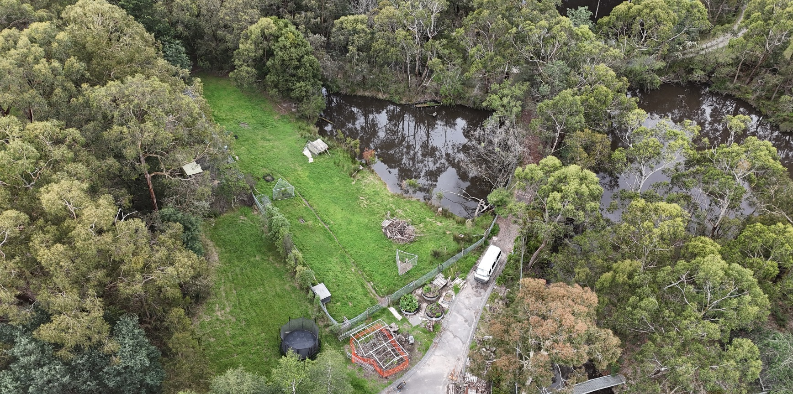
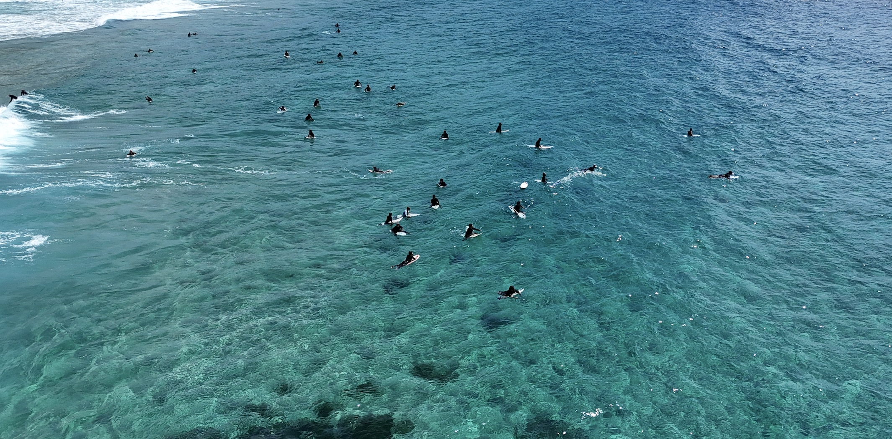
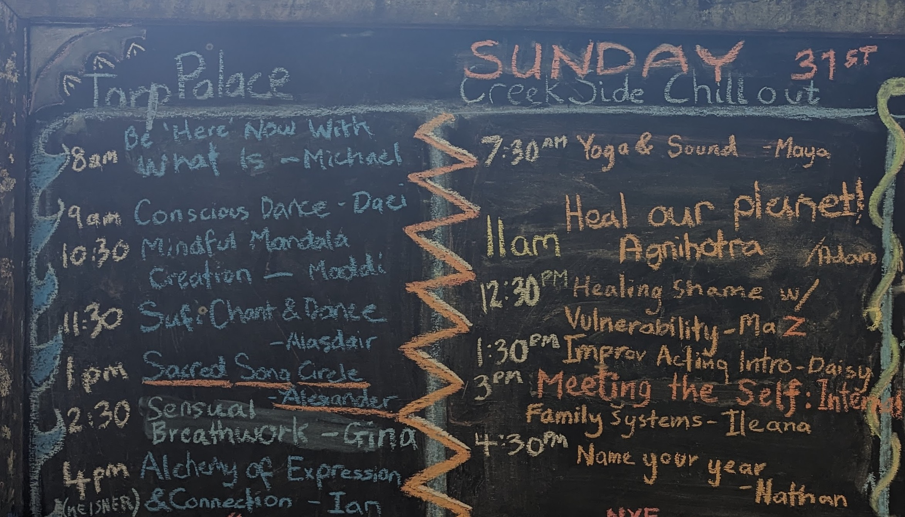

This is going to be my dynastic version of the "Date Me" post phenomena. Take it as a prayer, as an intention; take it as me lighting a beacon.

This is worth reading if:
- You are curious why someone would be thinking about their dating life in the context of 'dynasty'
- You know a dynastically-minded, and available dancetress who you can connect me with
- You yourself are interested in me as a partner

Summary:
> - Australian man seeks wife for wholesome usurping of the current world-order
> - Kids as priority, after an appropriate courtship
> - Preferably somewhere touched by the Pacific Ocean (Legal residency accessible in AUS, USA and NZ)
> - Dancing is a must

## Dynasty

Not a word we hear a lot outside of period dramas, historical works, and fantasy novels. It has been with me over the last few months, as I have sat with questions about love, life and calling. What does dynasty evoke for you? For me, it evokes:
- Intentionality,
- Devotion,
- Love,
- Family,
- Death,
- Having children,
- My ancestors and lineages,
- My children's children, and their children, and beyond,
- Partnership,
- Co-creation with my partner and their family and lineages, and
- A greater purpose, a greater narrative, to our collective lives

We have such an incredible impact on the lives of our family. I am blessed and lucky to be a part of a great family. My folks (and their brothers and sisters) grew up with really challenging parenting circumstances. I'm so grateful to my folks for creating a loving and nurturing family-life for us. I never knew how rough they had it until I was an adult; and I learnt that from stories, not from them acting out their traumas on us kids.

We grew up in a beautiful, safe and lucky place. All of this has been an incredible gift, and I hope I honour that gift by bringing my own gifts into the world.

One of the ways I am most excited to share my gifts is by having a family. The creation of life, and the duty to uplift and care for life. Finding the right partner, mixing the wonderful gift of our lives, and co-creating an extension of our culture and lineages.

There is so much richness that I have seen in my [rites of passage work](twicefire.com/tags/rites-of-passage) over these years, and in what I have seen of my friends and family raising their own kids. And yes, a lot of Herculean efforts, nappies, tantrums, kid-drop-offs, scheduling madness, rejected meals and frustration mixed in with all of that.

This idea of dynasty asks us to consider how we are consciously acting to shape and impact the different generations of our families; whether past, living or future. What lessons and traditions are we passing down through that line? What things are we releasing and letting go of? How are we engaging with other families and friends to form wider community and resilience?

> So why haven't I sorted all this out yet?

How is this handsome, dancing Australian fella with all these lofty notions still single and ready to mingle? The short answer is: I thought I had my life-partner already. We were together for almost six years, with a lot of joy, love and happiness, and also a lot of hard-times, grief and adversity.

Last year, early in 2023, we lost our shared-vision, and that, combined with some unhealthy relational dynamics, brought our relationship (and engagement) to an end by the middle of the year. I am very complete with that relationship and wish my former partner nothing but the best.

### What I seek

> "Love does not consist of gazing at each other, but in looking outward together in the same direction."
>
> Antoine de Saint-Exupéry

There are so many directions one can look. So what would our mutual direction look like? **To flesh that out, I need you and your input.** And there are important things I yearn for, and specific ways that I see that world. The things I yearn for and the way I see; well those things heavily shape how I understand the future and the context in which our children will navigate life. If you and I diverge too much on these matters, then we will not be an 'us'. And we really ought to figure that out before involving anyone else!

To begin: I want us to have a family. Of our own blood. I want our family to be born out of love, co-creation and collaboration. I am ready for this, pending an appropriate courtship. I want us to have at least two kids, possibly more. I want my children to be vaccinated and to be omnivores.

We need to share embodiment as a core dependency and ideally, we have a dance connection. Dance is such an important source of aliveness for me, and I will prioritise it in my life, now and in the future. Beyond solo freestyle, I primarily dance 'new style hustle' and 'west coast swing', both are lead/follow slot-based styles, danced to contemporary music.

I want to raise kids based on what I think the great challenges of our times are, not based on societal defaults. As best as we can prepare our youth, they will have to make their own understandings, decisions and choices about the nature of the world and the challenges we face.

I want us to be sustained by and with love, joy and tenderness. I have so much affection and love to pour into those I love. It is also true that I am comfortable being alone and have grown accustomed to being physically separated from those I care for. Having grown up in Australia and having lived almost half my adult life in California, now, where-ever I am, I will always be an ocean away from someone that I dearly care for.

A grander vision is that we live somewhere that we own, that I/we have literally built, with a flourishing garden. We are nestled in beautiful surrounds, while still having community in walking-distance, including multiple other families with youth around the age of our kids. The surrounding community has a weekly dance practice. There are other families that also share the desire to raise their youth in a [regenerative culture](https://twicefire.com/regen/regenerative-culture/).

We have our own space but we also feel invested in nearby communal spaces. We have meaningful work that sustains our lifestyles, without robbing us from time with each other. Many aspects of this are in reach, or are things we can build towards; and... we will likely face trade-offs between different parts of this sort of vision. We have to be able to find the right way to balance any vision we share with our own needs and ideas about life.

### How I see the world

> \- in this world  
> \- we walk on the roof of hell  
> \- gazing at flowers
>
> kobayashi issa

That's it, in poetry form. For greater detail, you can find clues all over this blog. My rites of passage work has been a great expression of how I value youth, intergenerational exchange, ritual, and human development. You can find me dancing, both solo and partnered. My writings on Little Civilisation give insight into the challenges humanity faces, and how we can orient towards them.

A grab bag of other little details; I was a teenage high-jump state champion. I did the International Baccalaureate for my high school certificate (fun!). Got swept out to sea on a sky kayak, worked at a summer camp in upstate New York, visited the Zapatistas in Chiapas, got lost on a volcano in Guatemala, and joined the Army Reserve and graduated bootcamp with the skill-at-arms award, before I left my teenage years. I based all my life decisions around ultimate frisbee for a decade of my life. I finished an International Relations degree and joined the Australian Intelligence Community as a map and imagery analyst. Took a team of 20 plus people on a two year campaign to the World Ulitmate Club Championships in Prague.

I deployed as an analyst to Afghanistan for four months, including the worst day for casualties the Australian military faced since the Vietnam war. I moved to California to play ultimate and learnt how to code to get a job and visa. I played one point in a World Club Championship final game; another silver medal. I got booted from my American frisbee team and I got laid-off from my first startup because they couldn't raise more funds. Got a greencard through my next company.

Fell in love in a way I had only before dreamed of. Ran two youth groups in the Bay Area. Supported my partner as they healed their traumatic brain injury. Co-purchased a home with my friends. Started working for a project I really believed in, Hylo and the Terran Collective. Supported my partner through the tragic loss of their brother. Tried to plant an orchard (and failed). Did a tiny home building course. I broke my heart so I could learn to love again. While I build in 'cyberspace' during my work-day, I yearn to build homes for my communities. I have danced, and danced, and danced. There is always more to say but I will leave it there.

## What I seek in you
These are a selection of things I value in a partner. I offer each of them in return.

###### Decent overlap in world-view
There will always be divergence and disagreement. All healthy relationships will have space for that. And if we are too far apart on how we see the world, we will constantly clash on what sacrifices to make, how we want to invest our collective efforts and how to handle life. I've written a bunch about how I understand the world in this blog, and I yearn to hear how you make sense of everything around us.

###### Discernment
For everyone's sake, mine, yours, our children and all we interact with, I want you to be discerning, wise and committed to thoughtfulness.

###### Reliability
Part of my worldview is that things are going to get trickier before they get better. I want someone that has my back when the storm of life is blowing hard.

###### High agency
Someone that is doing stuff in their life, beyond just getting by.

###### Ready for parenthood
Motherhood is a big deal and a very special life initiation. I am ready to have kids, after an appropriate courtship. I am now older than my dad was when he had me (I'm the third of four kids); I really want to show up for my kids in their teenage years the way that he did for me and my siblings. This means wanting to have the first kid in the next few years, and ideally avoiding the need for expensive IVF for any of our kids.

###### Embodiment and Pleasure-positivity
Are you connected to your animal self? To your pleasure? To how your feelings show up in your body? To your hunger, to pain, to thirst? Do you have a regular practice of attuning and looking after these needs? Do you own those needs, feelings and impulses, or project them on to others or on to the stars? We need to incorporate joy, pleasure and healthy relationships to our bodies into whatever society comes next.

###### Financially stable
Straight-forward but not underrated

###### Able to interact with the mainstream without being consumed by it
While we might yearn for a different vision of the way things are... we still have to deal with the-way-things-are.

###### Banter, playfulness
Look, this all makes me sound incredibly serious. And I am! But also, I am a very silly-goose. I sing and hum constantly. I enjoy word-play, banter and bad puns. I bring that energy into all facets of my life.

###### Openness to alternative child-rearing
There are plenty of cliches about contemporary child-rearing that I want to avoid.  Finding the right balance is key; don't want to be consumed by the system or be completely outside it.

###### Kindness, attunement, awareness, open communication
These are fundamental ways of being in relationship to others that I value and want to be a basis for family-life.

###### Discipline and shared-sacrifice
When we have shared values and vision, it's easier to make sacrifices. Saying a deep yes to a vision requires saying no to other visions and possibilities. Saying no requires discipline and giving up possibilities is a form of sacrifice.

######  You gotta be into me
If we ain't smitten with one another... seriously why should we bother? I want our kids to be grossed out by how in love we are.

## Tensions in my desires
There are absolutely known tensions in either the things that I yearn for in partnership or in some of the women that I have been initially drawn to. These are not at all things that make a potential pairing untenable but they are important points of open discussion to be navigated if romance is to take flight.

###### Spirituality
Given I am into a lot of dance/embodiment communities, I encounter a lot of people that have a range of 'new age' beliefs or spiritualities that are different from mine. I rejected Catholicism in my teenage years (catholic boys school helped that along), and I grew up in a christian adjacent society. I have a fairly niche and arguably flat concept of divinity; *reality is divinity* and we go through life trying to grasp the dizzy totality of reality with our limited senses. Words/language can only hint at it all, akin to the saying "The Dao that can be expressed in language, is not the constant Dao". So I do not resonate with a lot of wordy forms of spirituality.

Difference is to be expected here, and, if we conceive of reality in such different ways that we make hugely different decisions and judgments about how to be in the world, that can be a point of tension in a relationship.

###### Purity
The world is fundamentally messy. I mean this in a physical sense but also in a metaphorical sense. Sometimes we have to rough it to get through. There are some extreme expressions of purity out in the world and I am not likely to make someone of that ilk conformable. We need to roll our sleeves up and muck in.

###### Ambition and Motherhood
I want to be with a high-agency, ambitious woman. A lot of ambitious women (and men) today see that ambition channelled into furthering their career, their freedom from restrictions and/or lifting their status. If one holds that frame of ambition, motherhood becomes particularly prickly.

While our understandings of the impact of motherhood (and parenthood more generally) are probably not the most calibrated, having a kid has a huge impact on the lifestyles of the parents, and an additional impact on the body of the mother. On top of that, breastfeeding (a huge energetic workload) is another thing that only the mother can do.

Career, being-untethered and status are, thankfully, not the only things that we can be ambitious about. They are not all that matters. A regenerative dynasty that rebuilds our communities, lands and waters is the sort of ambition that I want to share with someone. So in this sense I seek someone that is ambitious but not in a way that is limited to just the things in the predominant frame.

###### Relationship to place
Another current tension is my relationship to place. A life-partnership largely needs to be conducted in the same time/space 😘 . I've spent just over ten years in the USA, in California. I grew up in Canberra, Australia. Culturally, I am Australian, and I struggle to belong to 'America'. California (and the USA more broadly) has many wonderful things. But also many terrible and grating things.

While my kids will hopefully grow up in a community that has a strong regenerative subculture, I have a preference that the surrounding host culture be as healthy as well. And generally speaking, the quality of life is better in Australia and NZ than the USA. On top of that, I foresee increased climate instability in the future, and I would rather have my kids and myself experience that in a place with fewer guns and less polarisation.

###### Competing visions (dance, building, finances, travel, place)
This is the meta-tension; how to place the different priorities into a coherent journey. I want to build our home but is that done before kids? Have I got enough experience and resources to do that yet? Have we spent enough time building the foundation of our relationship, before building the foundation of our home?

I could easily go on, mixing in the pros and cons of different places/communities, work-life balance, etc. I cannot 'solve' this path by myself, since I need to understand what strengths and needs my partner would bring to this mix, and how those would all come into balance.

#### Questions for her...

These are just the start of all the things about 'her' that I am curious to understand...

- What do you yearn to offer the world?
- What are some of the visions you have for how the world could be, and what are some ways you want to bring that about by how you live your life?
- What are your lineages, your family stories, your connections to place?
- What ways do you bring ritual and ceremony into your life?
- What are the tensions in your desires for partnership?
- What are the ways you perceive that we overlap in mindset vs have divergence?
- What does it feel like for you to be divergent in some way from your partner, how does it show up in your body?
- What does union mean to you?

### So what comes next?
You made it this far, congratulations!

There isn't a set plan or process or formula for what comes next. Reach out to me and let's figure it out.
