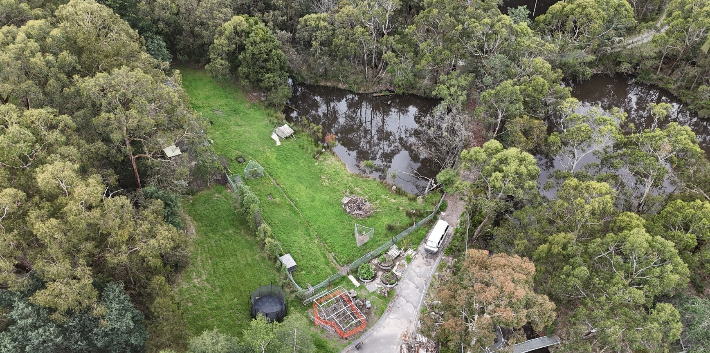
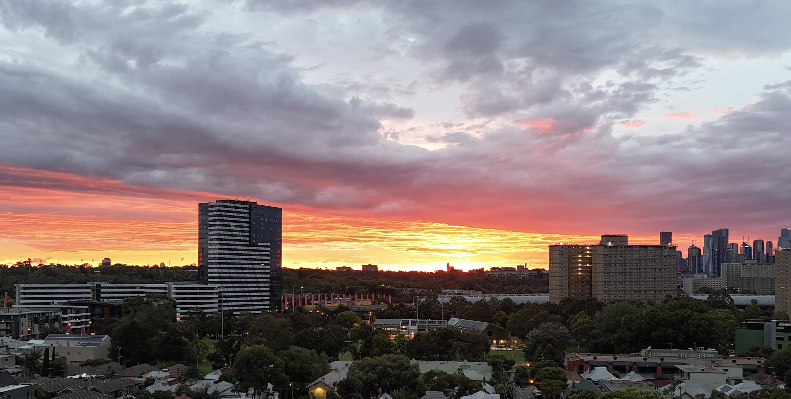
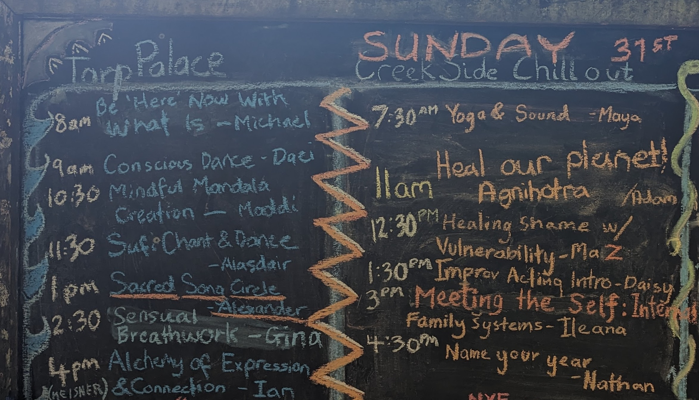
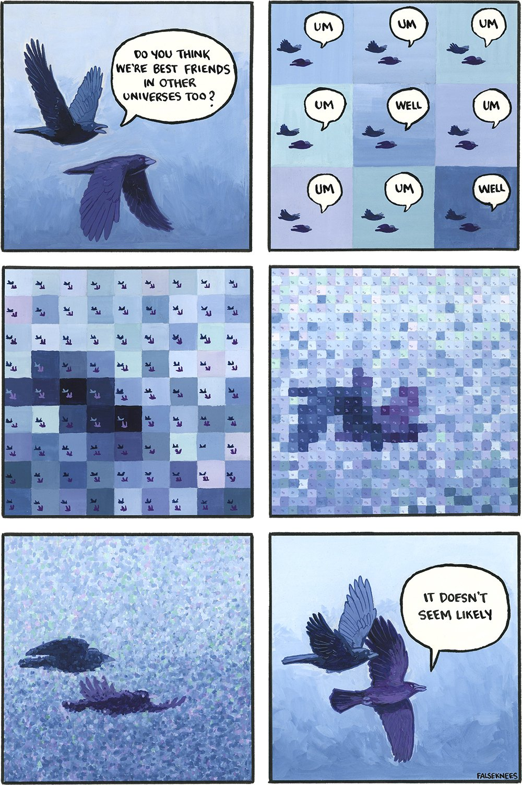
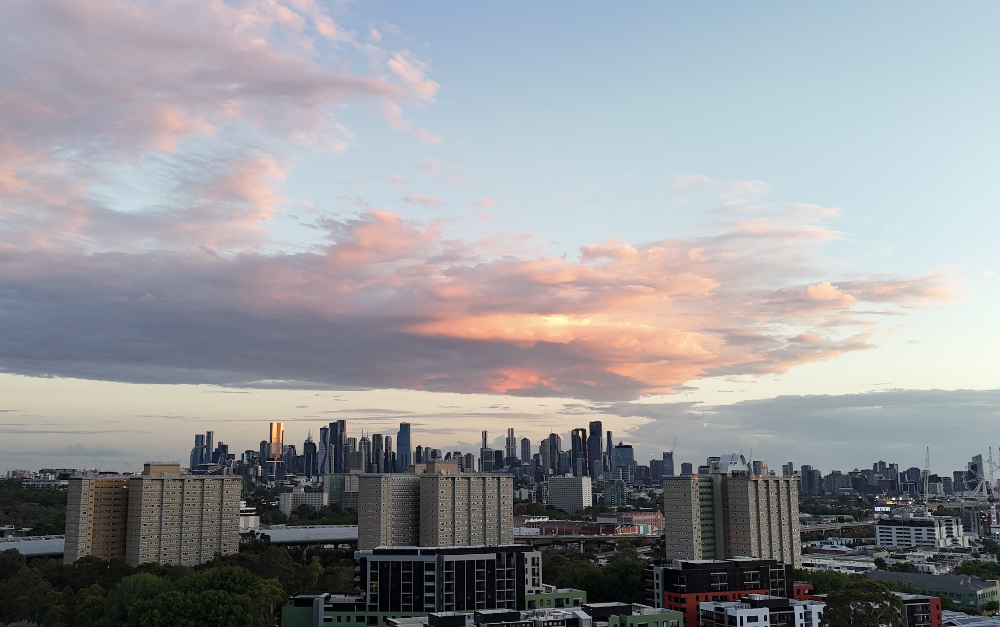

I have broken this up into two parts. Just want to give yall a break...

The first part is [here](https://twicefire.com/regen/dynasty/)

> As I was saying

## What I seek in you
These are a selection of things I value in a partner. I offer each of them in return.

###### Decent overlap in world-view
There will always be divergence and disagreement. All healthy relationships will have space for that. And if we are too far apart on how we see the world, we will constantly clash on what sacrifices to make, how we want to invest our collective efforts and how to handle life. I've written a bunch about how I understand the world in this blog, and I yearn to hear how you make sense of everything around us.

###### Discernment
For everyone's sake, mine, yours, our children and all we interact with, I want you to be discerning, wise and committed to thoughtfulness.

###### Reliability
Part of my worldview is that things are going to get trickier before they get better. I want someone that has my back when the storm of life is blowing hard.

###### High agency
Someone that is doing stuff in their life, beyond just getting by.

###### Ready for parenthood
Motherhood is a big deal and a very special life initiation. I am ready to have kids, after an appropriate courtship. I am now older than my dad was when he had me (I'm the third of four kids); I really want to show up for my kids in their teenage years the way that he did for me and my siblings. This means wanting to have the first kid in the next few years, and ideally avoiding the need for expensive IVF for any of our kids.

###### Embodiment and Pleasure-positivity
Are you connected to your animal self? To your pleasure? To how your feelings show up in your body? To your hunger, to pain, to thirst? Do you have a regular practice of attuning and looking after these needs? Do you own those needs, feelings and impulses, or project them on to others or on to the stars? We need to incorporate joy, pleasure and healthy relationships to our bodies into whatever society comes next.

###### Financially stable
Straight-forward but not underrated

###### Able to interact with the mainstream without being consumed by it
While we might yearn for a different vision of the way things are... we still have to deal with the-way-things-are.

###### Banter, playfulness
Look, this all makes me sound incredibly serious. And I am! But also, I am a very silly-goose. I sing and hum constantly. I enjoy word-play, banter and bad puns. I bring that energy into all facets of my life.

###### Openness to alternative child-rearing
There are plenty of cliches about contemporary child-rearing that I want to avoid.  Finding the right balance is key; don't want to be consumed by the system or be completely outside it.

###### Kindness, attunement, awareness, open communication
These are fundamental ways of being in relationship to others that I value and want to be a basis for family-life.

###### Discipline and shared-sacrifice
When we have shared values and vision, it's easier to make sacrifices. Saying a deep yes to a vision requires saying no to other visions and possibilities. Saying no requires discipline and giving up possibilities is a form of sacrifice.

######  You gotta be into me
If we ain't smitten with one another... seriously why should we bother? I want our kids to be grossed out by how in love we are.

## Tensions in my desires
There are absolutely known tensions in either the things that I yearn for in partnership or in some of the women that I have been initially drawn to. These are not at all things that make a potential pairing untenable but they are important points of open discussion to be navigated if romance is to take flight.

###### Spirituality
Given I am into a lot of dance/embodiment communities, I encounter a lot of people that have a range of 'new age' beliefs or spiritualities that are different from mine. I rejected Catholicism in my teenage years (catholic boys school helped that along), and I grew up in a christian adjacent society. I have a fairly niche and arguably flat concept of divinity; *reality is divinity* and we go through life trying to grasp the dizzy totality of reality with our limited senses. Words/language can only hint at it all, akin to the saying "The Dao that can be expressed in language, is not the constant Dao". So I do not resonate with a lot of wordy forms of spirituality.

Difference is to be expected here, and, if we conceive of reality in such different ways that we make hugely different decisions and judgments about how to be in the world, that can be a point of tension in a relationship.

###### Purity
The world is fundamentally messy. I mean this in a physical sense but also in a metaphorical sense. Sometimes we have to rough it to get through. There are some extreme expressions of purity out in the world and I am not likely to make someone of that ilk conformable. We need to roll our sleeves up and muck in.

###### Ambition and Motherhood
I want to be with a high-agency, ambitious woman. A lot of ambitious women (and men) today see that ambition channelled into furthering their career, their freedom from restrictions and/or lifting their status. If one holds that frame of ambition, motherhood becomes particularly prickly.

While our understandings of the impact of motherhood (and parenthood more generally) are probably not the most calibrated, having a kid has a huge impact on the lifestyles of the parents, and an additional impact on the body of the mother. On top of that, breastfeeding (a huge energetic workload) is another thing that only the mother can do.

Career, being-untethered and status are, thankfully, not the only things that we can be ambitious about. They are not all that matters. A regenerative dynasty that rebuilds our communities, lands and waters is the sort of ambition that I want to share with someone. So in this sense I seek someone that is ambitious but not in a way that is limited to just the things in the predominant frame.

###### Relationship to place
Another current tension is my relationship to place. A life-partnership largely needs to be conducted in the same time/space 😘 . I've spent just over ten years in the USA, in California. I grew up in Canberra, Australia. Culturally, I am Australian, and I struggle to belong to 'America'. California (and the USA more broadly) has many wonderful things. But also many terrible and grating things.

While my kids will hopefully grow up in a community that has a strong regenerative subculture, I have a preference that the surrounding host culture be as healthy as well. And generally speaking, the quality of life is better in Australia and NZ than the USA. On top of that, I foresee increased climate instability in the future, and I would rather have my kids and myself experience that in a place with fewer guns and less polarisation.

###### Competing visions (dance, building, finances, travel, place)
This is the meta-tension; how to place the different priorities into a coherent journey. I want to build our home but is that done before kids? Have I got enough experience and resources to do that yet? Have we spent enough time building the foundation of our relationship, before building the foundation of our home?

I could easily go on, mixing in the pros and cons of different places/communities, work-life balance, etc. I cannot 'solve' this path by myself, since I need to understand what strengths and needs my partner would bring to this mix, and how those would all come into balance.

#### Questions for her...

These are just the start of all the things about 'her' that I am curious to understand...

- What do you yearn to offer the world?
- What are some of the visions you have for how the world could be, and what are some ways you want to bring that about by how you live your life?
- What are your lineages, your family stories, your connections to place?
- What ways do you bring ritual and ceremony into your life?
- What are the tensions in your desires for partnership?
- What are the ways you perceive that we overlap in mindset vs have divergence?
- What does it feel like for you to be divergent in some way from your partner, how does it show up in your body?
- What does union mean to you?

### So what comes next?
You made it this far, congratulations!

There isn't a set plan or process or formula for what comes next. Reach out to me and let's figure it out.
