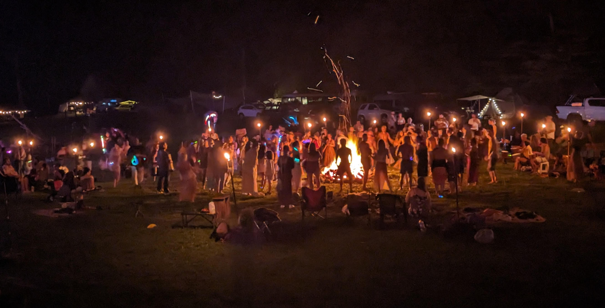
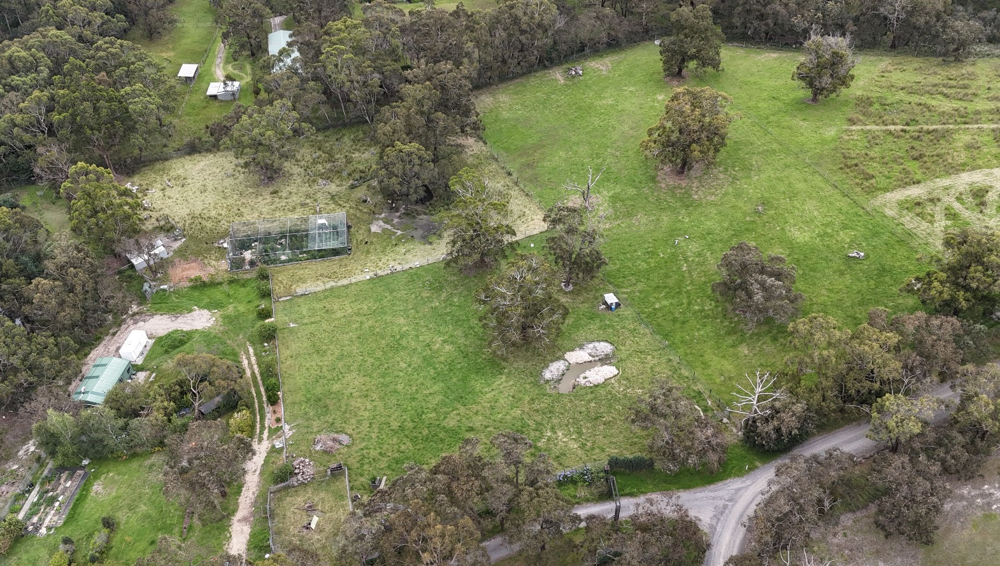
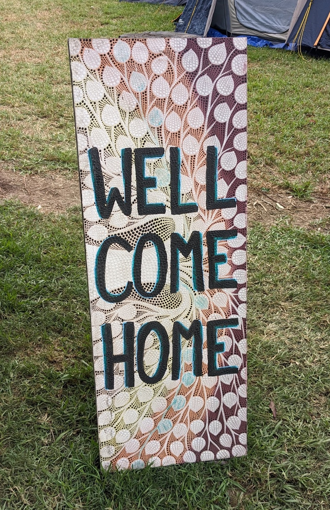
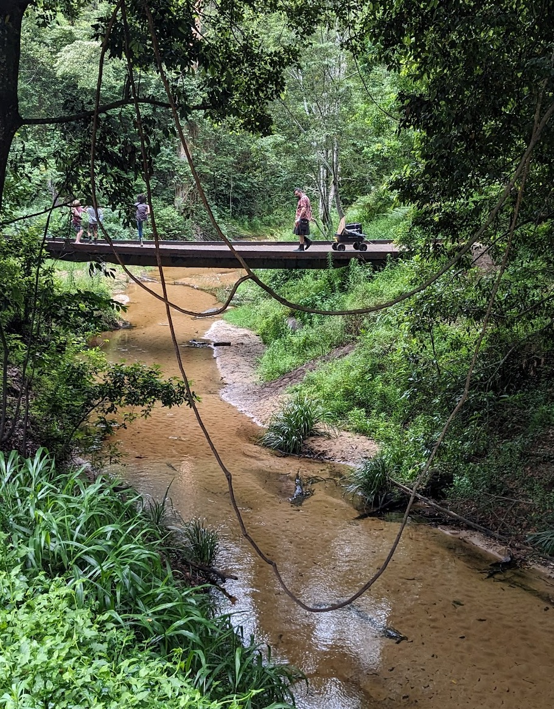
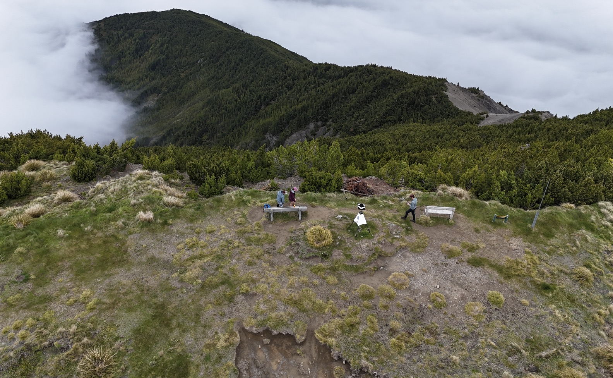
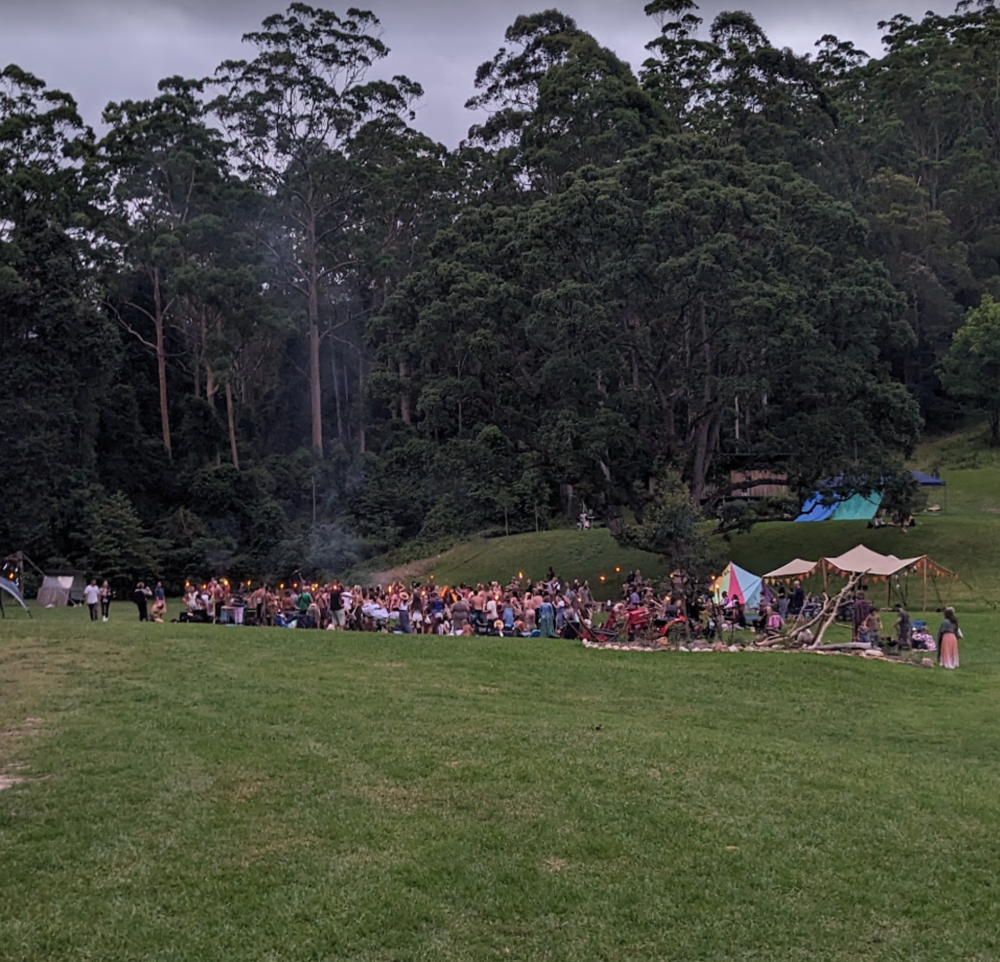
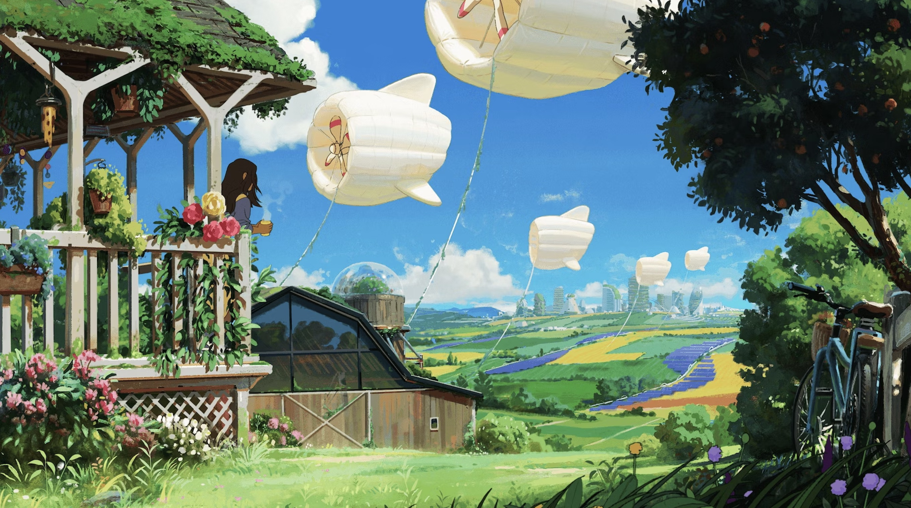
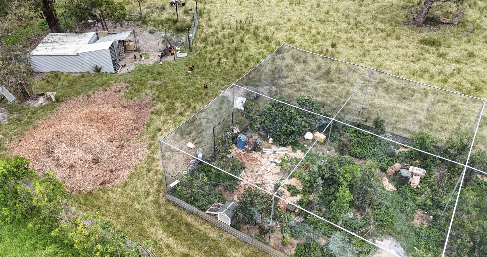

'Ello loves,

Over the last few years, I have increasingly been using the term 'regenerative culture' as an umbrella term to capture the vibe of all the stuff we should do/be, to take humanity to a better place. Vibes-based terminology can only get us so far (alas 😉). Folks ask me what I mean when I talk about regenerative culture; my answer has been 'Great question!'. Let us see how this attempt goes.

#### Why is regenerative culture even worth talking about?

To boil down the overall context; the colonial and industrialization periods of the last few hundred years wrote the grand narratives of Modernism. These were motivating narratives wrapping up themes like progress, technological advancement, 'bringing civilization to the world', 'man conquering nature', 'individual vs communal', material development and the primacy of 'rationality'. Communism, Fascism and Capitalism and their attendant sub-types are all big Modernist narratives.

The last century has seen the rise of Post-Modernism; uncovering the shadow-side of Modernism. These are things like 'actually colonialism and wrecking cultures is terrible', 'Oops, we ganked the environment', 'implicit power dynamics mess up everything', or 'your definition of progress is myopic and sucks for most people'. These critiques of Modernism were necessary but typically did not include alternative compelling narratives to Modernism, sometimes disavowing narratives at all.

One of the challenges of that, however, is that we (humans)... we need narratives. They are a pretty important part of our ability to make sense of the world around us, and our place in it. Without that, we struggle for meaning, purpose, and the living of a fulfilling life. The tension between Modernism and Post-Modernism still takes up a lot of narrative space (As do older grand narratives from prior ages, such as the monotheistic world-views). They are like a gaping global maelstrom that pulls at our cultures and narratives. 

This maelstrom is complexity embodied; in contemporary globalisation, the interplay between differing governing bodies and, everyone's favourite, the internet. To survive and live in this world of greater complexity... we have to live with the maelstrom and navigate it. But just surviving cannot be our aspirational goal. To weather and pass through the storm, we need a point beyond us that we can strive towards. Regenerative culture is not that singular point; I do not frame it as a singular narrative. But it is a cluster of adjacent narratives that are the direction I think we should be heading towards.

Regenerative culture is a part of the nebulus ideas and narratives emerging after Post-Modernity (and we can't just call it Post-Post-Modernity). Meta-modernism, and related integrationalist approaches do inform my understanding of the 'nebulus-next'. I do think they are worth reading into (I like ['The Listening Society'](https://www.goodreads.com/en/book/show/36107916)).

Lots of folks are fed up with the narratives spinning out of the maelstrom, or they have a sense that the way things work today cannot continue. Without a compelling narrative about how to turn things around, each of us face the pull of nihilism, escapism, listlessness or the old narratives. I have seen this in myself, my peers and also in the youth I have interacted with. We must do better, and regenerative culture is the direction we must seek, even if we don't know the precise destination.

#### What is the goal of regenerative culture?

Regenerative cultures are cultures that create a healthy, fulfilling and integrated way of life for humanity that can be sustained in the long-term. There will inherently not be 'one' way of doing this, because of the diversity of humanity and the ecologies in which we live. This goal for regenerative culture is broad; Grand narratives/visions associated with regenerative culture would be more specific. For example maybe its "Our destiny is to be the ecologically integrated stewards of our incredible home, Earth".

I don't currently have a particular narrative I'm attached to at the moment but even if I did, it could easily be not-the-right-one... we need to have different groups trying out different regenerative narratives because we'll only find out which ones stand the test of time after we have all returned to the soil.

#### What are the themes of regenerative culture

I reiterate; regenerative culture is an umbrella term. When I ponder if something is a part of regenerative culture, I am not applying a set of predefined criteria. Instead I think the approach is outlining some of the themes of regenerative culture, and whether something resonates or addresses some of the themes; well that is probably good enough for now. Lets get stuck into some of the themes

###### Context matters
There are bold imperatives in Modernism and Post-Modernism, that flatten out nuance and context. You might think that "More trees equals better" would be a mainline creed for regenerative culture but it shouldn't be. There are ecologies were more trees would mean less flourish or diversity. Regenerative culture is more about understanding the context of a situation before applying our wisdom or knowledge. This leads to...

###### Relationality
The relationship between things and how they interact is really really important context. I was trying to think of a title for the importances of focusing on the relationship between things, and kinda 'made up the word' relationality without knowing if it was a real word. And then, with a quick web search, I found that indeed it already was a term in use for this very purpose! How the web of things relate to one another is a recurring theme in regenerative thinking, pointing to the importance of systems-level and holistic understanding, which takes us to...

###### Indigenous knowledge
Overlooked by Modern and Post-Modern thinking, indigenous knowledge has often come from cultures that have sustained themselves for a long-time. There are ways of looking at the world, and also specific practices and knowledge that many different indigenous cultures have that are regenerative cultures. Other emergent forms of regenerative culture ought to take heed of this wisdom.

And I do not suggest that indigenous cultures are free of practices that we should avoid. Unfortunately indigenous knowledge has been actively attacked by colonial efforts, with attempts to break the chain of cultural transmission by disrupting the connection between generations, which brings us to...

###### Intergenerational
Regenerative culture needs to reintegrate intergenerational mixing in our societies. There will always be a difference in the vertical (intergenerational) vs horizontal (peer) relating and that's fine and good. But the scales are tipped too far away from the intergenerational in much of the industrialised world. Without the intergenerational transmission of culture, the maelstrom gets a much bigger say in the culture of each generation, for better or worse. To avoid that, we have to...

###### Re-intergrate youth
The spaces that kids can inhabit have shrunk significantly in the industrialised/car-dependent societies of the world. The millennial generation (I'm one) additionally seems to be struggling with fears and anxieties about family-life. There is plenty to unpack about that (this recent [Vox article](https://www.vox.com/features/23979357/millennials-motherhood-dread-parenting-birthrate-women-policy) is a nice start). There are also plenty of ways in contemporary society that a certain type of hyper-focus on kids is actually quite unhealthy. So there is a lot to be explored and questioned here. This space is best explored with a clear goal in mind, swinging our focus to...

###### Human development
In a broad-stroke, we have been overly focused on a narrow set of educational, consumption and achievement-based metrics/goals for youth and ultimately societal development. Education systems are pulled out of alignment by implicit goals/influences like 'separating kids from the rest of society', 'Make kids obedient/docile', 'bureaucratization of education' and 'minimum viable consumer'. Few children (and ultimately adults) come out of this process well-rounded, feeling-respected and with a sense of how to explore their purpose. We are churning humans through this system and instead of making our societies holistically more vibrant, resilient and healthy, we are net-sum getting more polarised, more stratified and dysfunctional.

The complexity that comes with the maelstrom demands more of us as a society, in order to navigate the future. Instead of a societal focus on 'economic development', we need to cultivate a focus on 'human-development'. This shift will take time however; it's likely we can only improve this partially with every generation. We need to maintain this goal in the face of much upheaval and challenge, over a time-scale that we typically don't operate in, which means we need to have...

###### A different relationship to time
The pithy moniker for this that I like is seven-generation thinking, [first articulated by the Haudenosaunee](https://www.ictinc.ca/blog/seventh-generation-principle). The maelstrom exerts a lot of different pressures to make us think in tiny-time frames; cue all the talk of the 'attention economy', ADHD, electoral cycles, financial quarters and the like. While we should not forgo concerns of the now, without the balanced anchoring of a future we are heading towards, the speed we operate in during the 'now' can just get us nowhere-good fast.

I like the seven generation time-line because it centres the connection between ancestors and descendents, and because it feels not too far in the future that it becomes abstract. Roughly speaking, I am conceiving of the length of a contemporary generation to be 25-30 years, so seven of those is 175-210 years in the future. Imagine how incredibly different your life is now, to the lives of your forebears over 200 years ago? How could we possibly coordinate our visions and efforts over so many generations and years? Well, the way I would frame it is...

###### Living Tradition
Maybe including living tradition is seven generation thinking but looking back through your lineages. It is a call to understanding and examining where you have come from but not a call to mindlessly adopt, embrace *or* reject all that has come before. And the 'living' part of 'living tradition', is recognising that traditions are not static, and that they do shift and change over time.

I choose to shape and consider the lineages I am connected to, and create a new expression of them in the living of my life and the raising of the next generation. And I know and want the next generation and the generations after that, to in-turn, make their own conscious choices about how to constitute tradition in their lives. How one goes about this, well, its all about...

###### Integration
Integration is a direct call to having time for reflection, and applying judgement to our observations as we move through life. A regenerative culture needs to take heed of where things are now; there will be hard trade-offs to take and whatever beautiful visions come out of regenerative grand narratives will take generations to bring into being at scale.

If we cannot acknowledge that, we will chase something beautiful but have our motivation come aground when we inevitably face the complexity of reality. Beyond integrating our lineages, and the trade-offs about how we bring our visions to bear, another key area to integrate is...

###### Relationship of self and the collective
In the Terran Collective, we take the holon as our sigil; __[A holon](https://en.wikipedia.org/wiki/Holon_(philosophy))__ __(Greek: ὅλον, from ὅλος, holos, 'whole' and -ον, -on, 'part') is something that is simultaneously a whole in and of itself, as well as a part of a larger whole.__ Lots of societies tend to favour either the individual or the collective as a core orientation for their cultures. Ultimately, a regenerative culture will need to integrate these two, in line with the holonic understanding of the reality that we humans are both our own entities and also part of a greater whole.

I can't imagine a regenerative culture that is more individualistic than those I've encountered around the world today, and while I could imagine regenerative collective-primary cultures, I fear some of the possible shadow sides of those. Getting the integration right between the self and the collective will be vital for figuring out...

###### How we meet our core needs
How we define core needs lies at the intersection of being thinking-feeling entities inhabiting animal bodies and the choices we make. Regenerative culture will entail a closer relationship to our food and our built-environment (our shelter, where we live and work and spend much of our lives) and it will need to factor in our innately social creatures.

These core needs are where topics like regenerative agriculture, regen finance/economies, villaging and the like loop into regenerative culture. The maelstrom absolutely impacts these core needs and also what many folks implicitly centre as their core-needs (excess-consumption, for example). To work against or around that influence, we are going to need to exercise...

###### Power-with, not power-over
Regenerative culture absolutely needs to have an appreciation of power. Power-with, not power-over, is an expression I first encountered via the ProSocial movement, and strives to have power dynamics as co-created, collaborative coordination, as opposed to the common paradigm of coercive power-over.

There is vast complexity to uncover and explore here for any culture attempting to be regenerative, whether that is touching on norm-making, laws, enforcement, policing, international relations, freedom of association, in-group/out-group relations, democracy, voting, elections, governance, group dynamics, inclusion, oppression/liberation etc etc. Not going to dive into any of that now, since we need to wrap this up with a few more themes like...

###### Art/Aesthetic
Regenerative culture needs to inspire us and communicate its vibe via an aesthetic. Earlier when I spoke of regenerative culture as a kind of 'vibe', in part the aesthetic of a movement is one of the key ways to transport the vibe of it. Vibes are also very tricky business; they have an indefinable quality to engaging with them. They can be subverted, reversed, confused, missed, heavy-handed and subtle.

The solarpunk aesthetic is probably the most well-known vibe that I consider regenerative. And it's not very well-known. Maybe the punchiest/most-impactful solarpunk art produced has been a [short advert](https://youtu.be/UqJJktxCY9U?si=wwyPcXVzGfeOgx96) from a yogurt company! I don't have a great handle on art and aesthetics, outside of dance. But I do hope the images I include in my posts capture some of the aesthetics of what I value.

###### Ecological systems thinking
Ecology is so foundational to regenerative culture that I forgot to include it in the first version of this post. Ecologies are complex systems; understanding their constituent pieces is helpful but so much of what goes on in an ecology comes from the relationships and interactions of all of its pieces. We have to bring this lens and way of understanding the world, into all aspects of how we act and intervene in the world.

###### Mystery
We need to have some sort of relationship to the divine. Mystery, God, divinity, what ever you want to call it, regenerative culture has to speak to it in some fashion. I emphasise this for myself, more than anyone else; for me it's a reminder to be humble about our place in the universe and our understanding of it.

There are some grand narratives that are completely anchored/fixated on religion; that is not what 'acknowledging the mystery' is going for. But the need for integration and honouring our lineages and traditions calls for a way for mystery to be integrated into our lives via ritual and ceremony.

So that is the broad answer for the question of what regenerative culture is. I have tried to be true to the idea of it being an umbrella term, making it flexible enough to cover a lot of possibilities. I would love to hear what you think is missing, and not touched on, or if anything I have suggested is actually in opposition to regenerative culture. Please share your reflections <3

